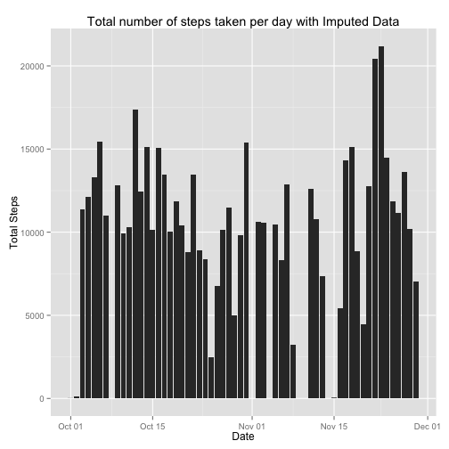
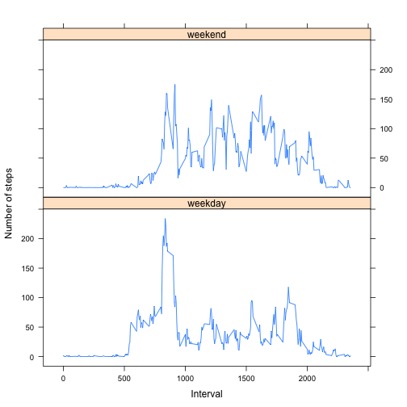

# Reproducible Research: Peer Assessment 1


## Loading and preprocessing the data

```r
## load libraries
library("ggplot2")
library("lattice") 

csvData <- read.csv("activity.csv",header=TRUE)
# convert the Date 
csvData$date <- as.Date(csvData$date, format = "%Y-%m-%d")
# get valid data
validActivityData <- na.omit(csvData)
# calculate na data
naRowCount <- nrow(csvData) - nrow(validActivityData)
```


## What is mean total number of steps taken per day?


```r
# aggregate total data for each day
dayData <- as.data.frame(as.list(aggregate(steps ~ date, data = validActivityData,FUN=function(x) c(mean =mean(x), occurs=length(x), total=sum(x) ))))
# calculate mean median of total steps taken per day
meanTotalSteps <- round(mean(dayData$steps.total),digits=2)
medianTotalSteps <- median(dayData$steps.total)
## Plot histogram
qplot(x=date,y=steps.total, data=dayData, geom="histogram",stat="identity",xlab="Date",ylab="Total Steps",main="Total number of steps taken per day")
```

 

The mean of total number of steps taken per day is 10766.19

The median of total number of steps taken per day is 10765


## What is the average daily activity pattern?

```r
# aggregate average steps for each interval across all days
intervalData <- as.data.frame(as.list(aggregate(steps ~ interval, data = validActivityData,FUN=function(x) c(mean =mean(x), occurs=length(x), total=sum(x) ))))
# calculate the interval with highest average steps
intervalHighest <- intervalData[intervalData$steps.mean == max(intervalData$steps.mean),]
## Plot time series of average steps across all days by interval
plot(intervalData$interval,intervalData$steps.mean, type="l",xlab="Interval",ylab="Average Steps",main="Average steps taken per interval")
```

 

835 is the 5-minute interval which contains the maximum number of steps on average across all the days in the dataset.


## Imputing missing values
The total number of missing values in the dataset is 2304

The strategy for imputing missing values in the data set shall be to use the mean steps value for a given interval across all days. The code implementing the strategy is included below.


```r
# make a copy of the original
imputedData <- as.data.frame(csvData)
## set na steps values to the average steps for that interval
for (i in 1:10) {
 if(is.na(imputedData[i,]$steps)){
     imputedData[i,]$steps <- intervalData[intervalData$interval == imputedData[i,]$interval,]$steps.mean
 }
}
# aggregate complete day data
imputedDayData <- as.data.frame(as.list(aggregate(steps ~ date, data = imputedData,FUN=function(x) c(mean =mean(x), occurs=length(x), total=sum(x) ))))
# calculate mean median of total steps taken per day of the complete data
meanCompleteSteps <- round(mean(imputedDayData$steps.total),digits=2)
medianCompleteSteps <- median(imputedDayData$steps.total)
## Plot histogram of the complete day data
qplot(x=date,y=steps.total, data=imputedDayData, geom="histogram",stat="identity",xlab="Date",ylab="Total Steps",main="Total number of steps taken per day with Imputed Data")
```

 

The mean of total number of steps taken per day is 10566.95

The median of total number of steps taken per day is 10682.5

Imputing missing data with the average steps per interval had very minimal impact on the estimates of the total daily number of steps.


## Are there differences in activity patterns between weekdays and weekends?

```r
# add the day value and dayType factor to imputed data
imputedData$day <-  weekdays(imputedData$date)
imputedData$dayType <-  sapply(imputedData$day,function(x) if(x %in% c("Sunday","Saturday")){"weekend"} else{"weekday"},simplify = "array")
# aggregate steps per each interval and day type
imputedIntervalData <- as.data.frame(as.list(aggregate(steps ~ interval+dayType, data = imputedData,FUN=function(x) c(mean =mean(x), occurs=length(x), total=sum(x) ))))

xyplot(steps.mean ~ interval | dayType,
       data = imputedIntervalData,
       type = "l",
       xlab="Interval",
       ylab="Number of steps",
   layout=c(1,2))
```

 

From the plot above. The activity patterns for weekdays indicate higher activity during the earlier intervals and on the weekends indicate higher activity on the later intervals.
